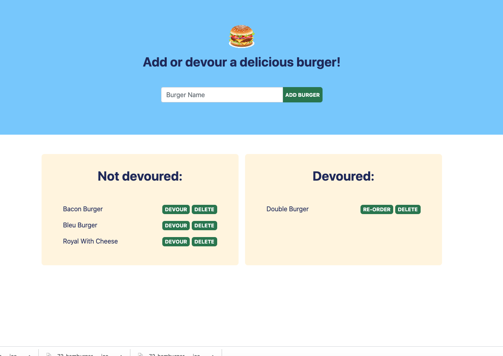

# Burger App #
  

  
  ## View Program ##
  
  

  * [Heroku Link](https://frozen-forest-67509.herokuapp.com/)

  ## Description ##

  Functioning app to add and remove burgers, devour when eaten, send back if wanting to re-order and lists all burgers added and eaten until deleted.

  ## Table Of Contents ##

  - [Description](#Description)
  - [Installation](#Installation)
  - [Usage](#Usage)
  - [Contributors](#Contributors)
  - [License](#License)
  - [Tests](#Tests)
  - [Repository](#Repository)
  - [Questions](#Questions)

  ## Installation ##

  1. Open through Heroku
 
  ## Usage ##

  1. Enter in burger you would like to eat, press add
  1. Delete Burger if you no longer want it on the list
  1. Devour burger by pressing button to move to devoured list
  1. Press re-order to move burger back to a side that you can devour again

  ## Contributors ##
  * [Aaron Platt](https://github.com/aaronkplatt)
  * [Matthew Rogers](https://github.com/Rogers-Development-Services)
  * [Nancy Lambert-Brown](https://github.com/n-lambert)
  * [Plover Brown](https://github.com/rebgrasshopper)
  * [Nicholas Konzen](https://github.com/NTKonzen)
  * [Talia Vazquez](https://github.com/taliavazquez)
  * [ShieldsIO](https://shields.io/category/license) 
  * [Nodejs.org](https://nodejs.org/en/)
  * [MySQL](https://www.mysql.com/)
  * [Orm]
  * [Express]
  * [Handlebars]
  ## License ##

  https://api.github.com/licenses/mit

  ## Tests ##

  Using jest or mocha you can run tests through the application using npm test.

  ## Repository ##

  - [My Projects Repository](https://github.com/tbsanders5/burger)

  ## Questions ##

  
  - Timothy Sanders
  - [My Profile](https://github.com/tbsanders5)
  - tbsanders5@gmail.com
